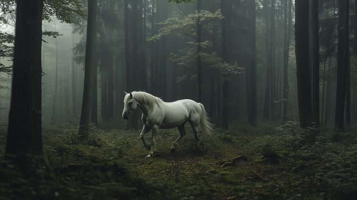
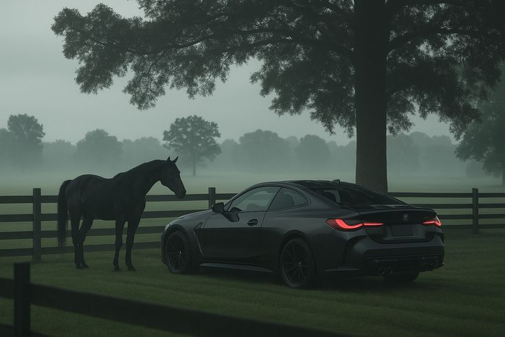

---
## 🌄 DynamicWallpaper — Smart Wallpaper Automation for Linux (GNOME)

Automatically change your wallpaper dynamically based on **time of day**, **weather**, or **system light/dark mode**.  
DynamicWallpaper integrates directly with your GNOME desktop to fetch **beautiful wallpapers** from **Unsplash** or your **local collection** — and even switches automatically when your system theme changes 🌞🌙.
---
## ✨ Features

- 🕓 **Time-based Wallpaper Switching**Automatically changes wallpapers for Morning, Afternoon, Evening, and Night.
- 🌤️ **Weather-based Mode** *(optional)*Uses real-time weather API to pick wallpapers that match your environment.
- 🌑 **Dark/Light Mode Detection (GNOME)**Detects theme change (`prefer-dark` / `prefer-light`) and adjusts wallpaper accordingly.
- 🌐 **Online Wallpapers from Unsplash**Fetches HD wallpapers using your own Unsplash Access Key.
- 💾 **Offline Wallpaper Cycle**Uses your custom wallpapers when offline.
- ⚡ **Quick Commands** to switch category or update instantly.
- 🧠 **Auto Session Linking for VS Code / Cron Jobs**
  Automatically connects to your GNOME session if environment variables are missing.

---

## 🧰 Tech Stack

| Component                     | Technology              |
| ----------------------------- | ----------------------- |
| **Language**            | Python 3                |
| **Desktop Environment** | GNOME (tested on v46.0) |
| **Wallpaper Engine**    | `gsettings` (DBus)    |
| **APIs**                | Unsplash API            |
| **Config Format**       | JSON                    |
| **Package Manager**     | pip                     |

---

## ⚙️ Prerequisites

Before you begin, make sure you have:

- **GNOME Desktop Environment** (v42 or newer recommended)
- **Python 3.8+**
- **pip** installed
- Internet connection (for online wallpapers)

---

## 🚀 Installation

```bash
# 1️⃣ Clone the repo
git clone https://github.com/<your-username>/DynamicWallpaper.git

# 2️⃣ Navigate to folder
cd DynamicWallpaper

# 3️⃣ Install dependencies
pip install -r requirements.txt

# 4️⃣ Make sure script is executable (optional)
chmod +x main.py
```

---

## 🔑 Unsplash API Setup (For Online Wallpapers)

1. Visit [https://unsplash.com/developers](https://unsplash.com/developers)
2. Log in → Click **"Your Apps"** → **"New Application"**
3. Give it a name like `DynamicWallpaper`
4. Copy the **Access Key**
5. Paste it in your config file:

```json
{
  "unsplash_access_key": "YOUR_ACCESS_KEY_HERE",
  "use_online_wallpapers": true,
  "use_weather": false,
  "interval_minutes": 15,
  "base_cycle": "cycle24hour",
  "mode": "time",
  "time_categories": {
    "morning": "morning",
    "afternoon": "afternoon",
    "evening": "evening",
    "night": "night"
  }
}
```

🗂️ Save it as:

```
/config/config.json
```

---

## 🧭 Folder Structure

```
DynamicWallpaper/
├── main.py
├── utils/
│   ├── wallpaper_changer.py
│   ├── weather.py
│   ├── online_fetch.py
│   └── category_builder.py
├── categories/
│   └── cycle24hour/
│       ├── morning/
│       ├── afternoon/
│       ├── evening/
│       └── night/
├── config/
│   └── config.json
└── temp/               # Stores downloaded online wallpapers
```

---

## 💻 Usage

### 🔹 Run Once

Change wallpaper **one time** and exit:

```bash
python3 main.py --once
```

### 🔹 Continuous Mode (Auto-Cycle)

Run continuously in the background:

```bash
python3 main.py
```

### 🔹 Set Specific Category

Change wallpaper manually to a given category:

```bash
python3 main.py --category night
python3 main.py --category morning
```

### 🔹 Add New Category

Create a new category folder automatically:

```bash
python3 main.py --add-category nature
```

---

## ☀️🌙 Light & Dark Mode Detection

The script automatically detects your **GNOME theme** and adjusts wallpapers accordingly:

| Mode          | Wallpaper Key        | Example                  |
| ------------- | -------------------- | ------------------------ |
| 🌞 Light Mode | `picture-uri`      | Morning/Day Wallpapers   |
| 🌙 Dark Mode  | `picture-uri-dark` | Evening/Night Wallpapers |

🧩 You can structure categories like this for theme-specific wallpapers:

```
/categories/cycle24hour/morning/light/
/categories/cycle24hour/morning/dark/
/categories/cycle24hour/evening/light/
/categories/cycle24hour/evening/dark/
```

---

## ⚡ Quick Commands Summary

| Command                                 | Description                    |
| --------------------------------------- | ------------------------------ |
| `python3 main.py`                     | Start auto wallpaper rotation  |
| `python3 main.py --once`              | Change wallpaper once and exit |
| `python3 main.py --category night`    | Manually change to a category  |
| `python3 main.py --add-category cars` | Add a new wallpaper category   |
| `Ctrl + C`                            | Stop continuous mode           |

---

## 🖼️ Default Sample Images

If you don’t have an Unsplash Access Key yet, a few **default wallpapers** will be used from the `/categories/default/` folder (already included).

| Preview                                        | Category |
| ---------------------------------------------- | -------- |
|  | Morning  |
|  | Evening  |
|  | Night    |

---

## 🛠️ Troubleshooting

| Issue                                        | Solution                                                                                          |
| -------------------------------------------- | ------------------------------------------------------------------------------------------------- |
| `No such key “color-scheme”`             | Your GNOME version doesn’t support this key — fallback uses GTK theme detection automatically.  |
| Wallpaper doesn’t change in VSCode terminal | Run script from system terminal OR ensure DBus environment is linked automatically by the script. |
| Unsplash API Error                           | Check your `unsplash_access_key`or internet connection.                                         |
| Dark/Light mode not switching                | Verify your GNOME theme changes in Settings → Appearance.                                        |

---

## 🧩 Example Logs

```
For Darkmode,
🌐 Fetching online wallpaper for category: night
🌙 Dark mode detected — using picture-uri-dark key
✅ Wallpaper set successfully: /home/user/DynamicWallpaper/temp/online_night.jpg
```

```
For Lightmode,
🕒 Time changed — Switching to 'evening' category
☀️ Light mode — applying wallpaper: sunset_view.jpg
✅ Wallpaper set successfully
```

---

## 👩‍💻 Contributing

DynamicWallpaper is  **open to contributions** ! 🎉

1. Fork the repository
2. Create your feature branch (`git checkout -b feature/amazing-feature`)
3. Commit your changes (`git commit -m 'Add amazing feature'`)
4. Push to the branch (`git push origin feature/amazing-feature`)
5. Open a Pull Request 🚀

---

## 📜 License

This project is licensed under the **MIT License** — free to use, modify, and distribute.

---

## Acknowledgements

* [Unsplash API](https://unsplash.com/developers) — for stunning wallpaper sources
* GNOME Project — for the desktop environment integration
* Python Community — for keeping automation elegant and fun

---

### Made with ❤️ by [Vishal Barai](https://github.com/vishalbarai007)

> “Every wallpaper tells a story — let yours change with time.”

```

```
